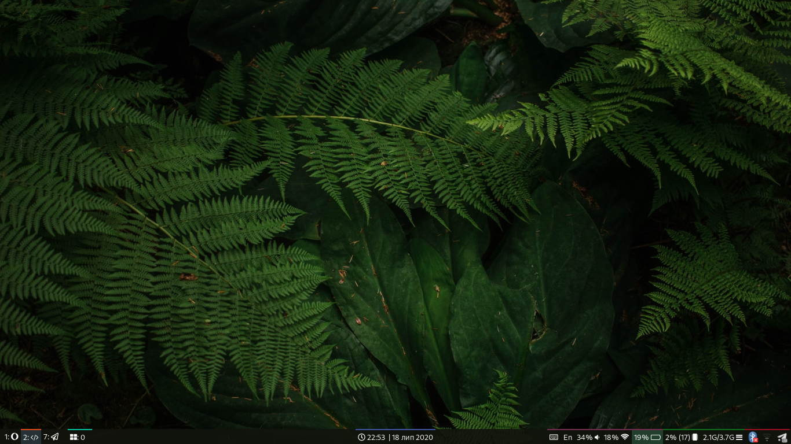
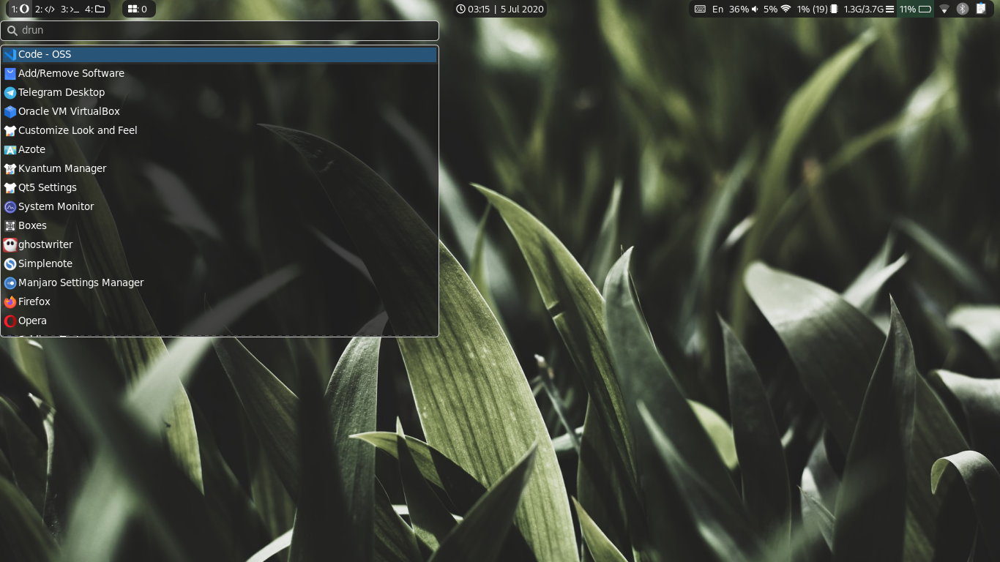
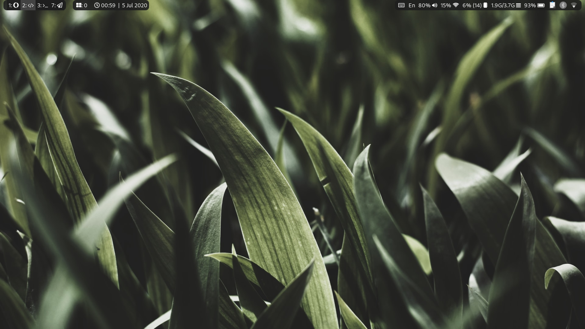
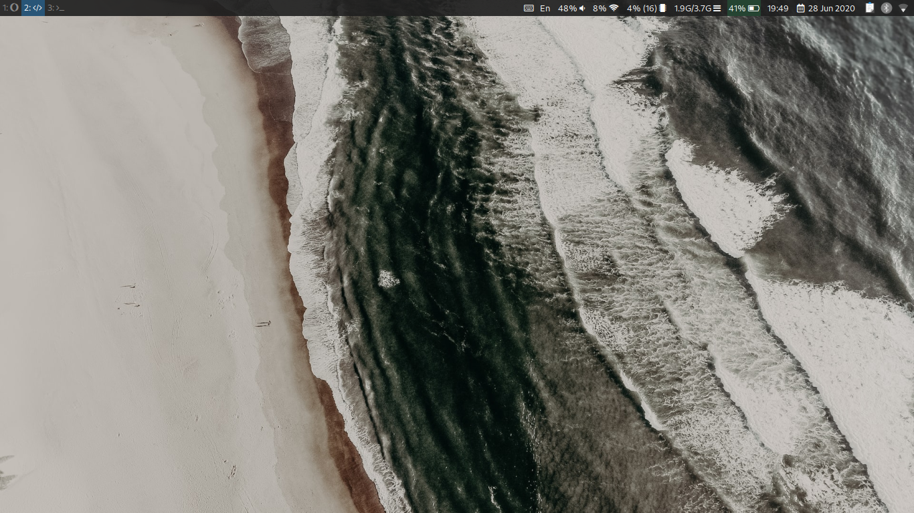

# Dotfiles for sway wm configuration

### Screenshots of my sway configuration

### Used packages:
* wofi - menu launcher
* bmenu - alternative menu
* swaylock-fancy - lockscreen
* grim - screenshot and colorpick utility
* slurp - utility for selecting an area
* brightnessctl - for brightness control
* pulseaudio/pavucontrol - for audio control
* waybar - bar for swaywm
* nm-applet/network-manager-applet-indicator - wifi applet
* mako - nitification manager
* earlyoom - out of memory manager
* redshift/redshift-wlr-gamma-control-git - blue light filter
* blueman/blueman-applet - bluetooth applet
* clipit - clipboard manager
* feh - image viewer
* mpg123 - play sound from terminal
* awesome font
* (polkit-gnome-authentication, qt5ct, tlp, tlp-rdw, )

### Some features

#### Scratchpad indicator:
Shows how much windows is hidden in scratchpad
* Left mouse click - move to scratchpad
* Right mouse click - show windows from scratchpad

#### Battery:

##### Beeper
Plays sound when capacity <= 10% every 60 seconds

##### Indicator
* green - charging
* default - discharging and capacity > 20%
* yellow - discharging and 10% < capacity < 20%
* red, blinking - discharging and capacity < 10%

#### Cpu indicator
* default - normal load
* yellow - load > 70%
* red - load > 90%

### Shortcuts
* Soon
